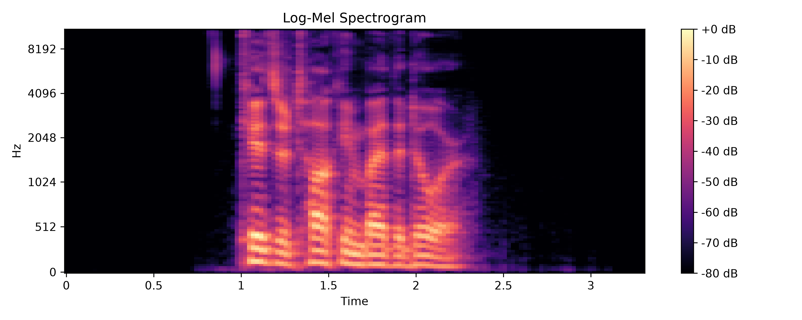
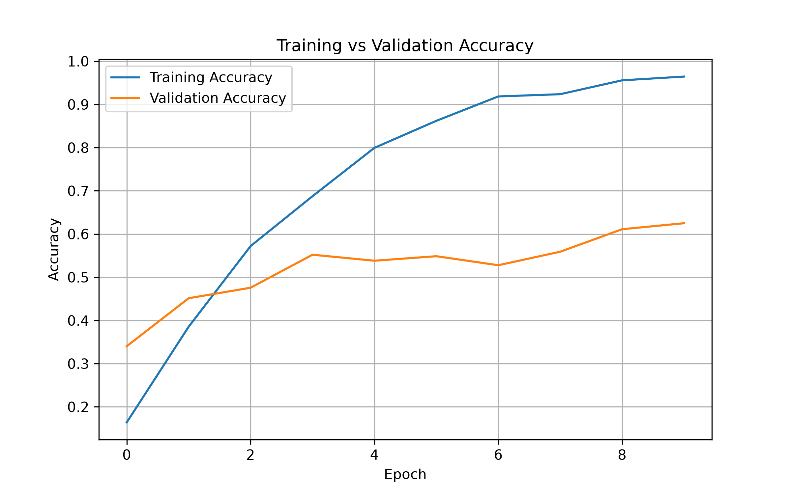
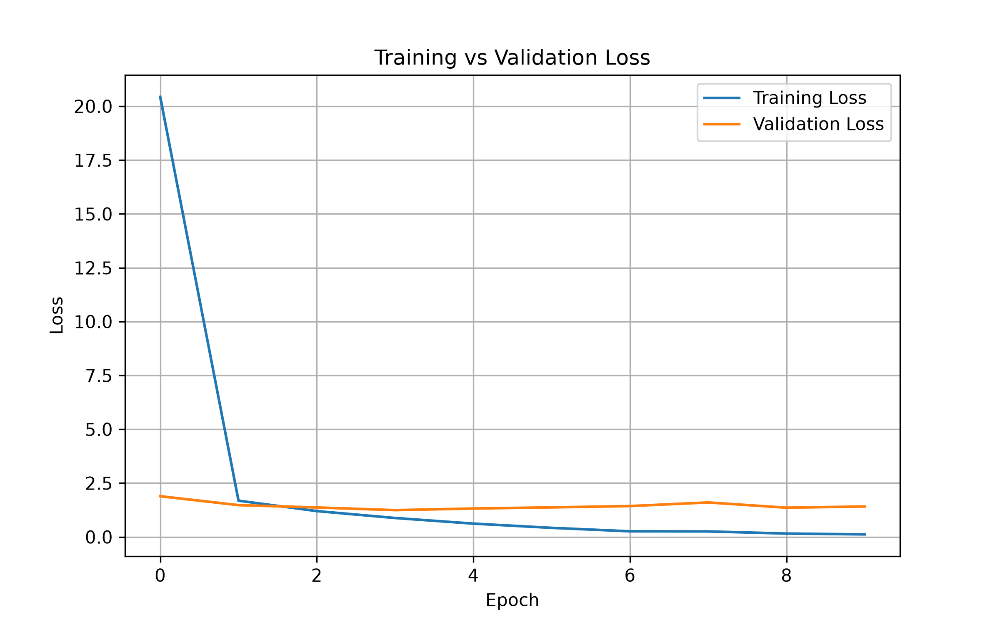

# Speech Emotion Classification using CNN

A deep learning project that classifies human speech into **8 emotion categories** using a **Convolutional Neural Network (CNN)** trained on the **RAVDESS** dataset.

---

## Project Overview

This project performs speech emotion recognition by converting audio recordings into log-Mel spectrograms and using a CNN to classify emotions from speech signals.

---

## Features

- Classifies speech into 8 emotion categories
- Audio preprocessing using Librosa
- Log-Mel spectrogram generation
- CNN implementation using TensorFlow/Keras
- Model training and evaluation on the RAVDESS dataset

---

## Technologies

- Python
- TensorFlow / Keras
- Librosa
- NumPy
- Matplotlib
- Scikit-learn

---

## Dataset

This project uses the **RAVDESS (Ryerson Audio-Visual Database of Emotional Speech and Song)** dataset.

Emotion classes:

- Neutral
- Calm
- Happy
- Sad
- Angry
- Fearful
- Disgust
- Surprised

---

## Workflow

```text
Speech Audio (.wav)
        │
        ▼
Audio Preprocessing
        │
        ▼
Log-Mel Spectrogram
        │
        ▼
CNN Model
        │
        ▼
Emotion Prediction
```

---

## Results

### Log-Mel Spectrogram



---

### Training Accuracy



---

### Training Loss



---

### Performance

| Metric | Value |
|--------|------:|
| Training Accuracy | ~91% |
| Validation Accuracy | ~50% |

The model successfully classifies speech into eight emotion categories. The gap between training and validation accuracy indicates overfitting, which can be reduced through data augmentation and further model tuning.

---

## Future Improvements

- Improve model generalization using data augmentation
- Experiment with deeper CNN architectures
- Add real-time microphone emotion recognition
- Deploy the model as a web application